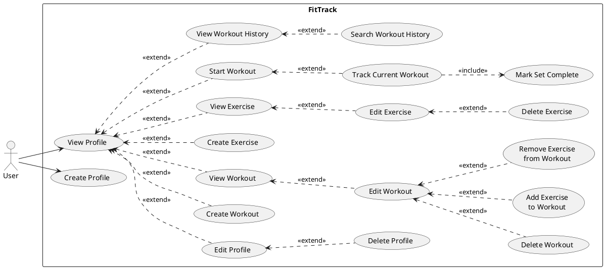
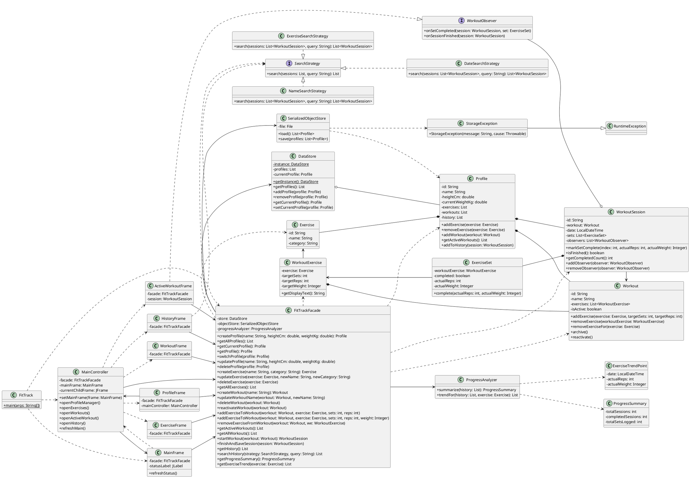

# Use Case Diagram

```plantuml
@startuml
left to right direction

actor User

rectangle "FitTrack" {

usecase "View Profile" as VP

usecase "Create Profile" as CP
usecase "Edit Profile" as EP
usecase "Delete Profile" as DP

usecase "Create Workout" as CW
usecase "Edit Workout" as EW
usecase "Delete Workout" as DW
usecase "View Workout" as VW

usecase "Create Exercise" as CE
usecase "View Exercise" as VE
usecase "Edit Exercise" as EE
usecase "Add Exercise\nto Workout" as AE
usecase "Remove Exercise\nfrom Workout" as RE
usecase "Delete Exercise" as DE

usecase "Start Workout" as SW
usecase "Track Current Workout" as TCW
usecase "Mark Set Complete" as MSC

usecase "View Workout History" as VWH
usecase "Search Workout History" as SWH
}

User --> VP
User --> CP

VP <.. EP : <<extend>>
EP <.. DP : <<extend>>

VP <.. VW : <<extend>>
VP <.. CW : <<extend>>
VW <.. EW : <<extend>>
VP <.. VE : <<extend>>
VE <.. EE : <<extend>>
EE <.. DE : <<extend>>

VP <.. CE : <<extend>>

EW <.. DW : <<extend>>
EW <.. AE : <<extend>>
EW <.. RE : <<extend>>

VP <.. SW : <<extend>>

VP <.. VWH : <<extend>>
VWH <.. SWH : <<extend>>

SW <.. TCW : <<extend>>
TCW ..> MSC : <<include>>

@enduml
```

# Class Diagram

Full application, including the `controller`/`view` (Swing) GUI layer.

```plantuml
@startuml
left to right direction
skinparam classAttributeIconSize 0

' ========== MODEL ==========
class Profile {
-id: String
-name: String
-heightCm: double
-currentWeightKg: double
-exercises: List
-workouts: List
-history: List
+addExercise(exercise: Exercise)
+removeExercise(exercise: Exercise)
+addWorkout(workout: Workout)
+getActiveWorkouts(): List
+addToHistory(session: WorkoutSession)
}

class Exercise {
-id: String
-name: String
-category: String
}

class Workout {
-id: String
-name: String
-exercises: List<WorkoutExercise>
-isActive: boolean
+addExercise(exercise: Exercise, targetSets: int, targetReps: int)
+removeExercise(workoutExercise: WorkoutExercise)
+removeExerciseFor(exercise: Exercise)
+archive()
+reactivate()
}

class WorkoutExercise {
-exercise: Exercise
-targetSets: int
-targetReps: int
-targetWeight: Integer
+getDisplayText(): String
}

class WorkoutSession {
-id: String
-workout: Workout
-date: LocalDateTime
-sets: List<ExerciseSet>
-observers: List<WorkoutObserver>
+markSetComplete(index: int, actualReps: int, actualWeight: Integer)
+isFinished(): boolean
+getCompletedCount(): int
+addObserver(observer: WorkoutObserver)
+removeObserver(observer: WorkoutObserver)
}

class ExerciseSet {
-workoutExercise: WorkoutExercise
-completed: boolean
-actualReps: int
-actualWeight: Integer
+complete(actualReps: int, actualWeight: Integer)
}

interface WorkoutObserver {
+onSetCompleted(session: WorkoutSession, set: ExerciseSet)
+onSessionFinished(session: WorkoutSession)
}

' ========== STRATEGY ==========
interface SearchStrategy {
+search(sessions: List, query: String): List
}

class NameSearchStrategy {
+search(sessions: List<WorkoutSession>, query: String): List<WorkoutSession>
}

class DateSearchStrategy {
+search(sessions: List<WorkoutSession>, query: String): List<WorkoutSession>
}

class ExerciseSearchStrategy {
+search(sessions: List<WorkoutSession>, query: String): List<WorkoutSession>
}

' ========== PROGRESS ==========
class ProgressAnalyzer {
+summarize(history: List): ProgressSummary
+trendFor(history: List, exercise: Exercise): List
}

class ProgressSummary {
-totalSessions: int
-completedSessions: int
-totalSetsLogged: int
}

class ExerciseTrendPoint {
-date: LocalDateTime
-actualReps: int
-actualWeight: Integer
}

' ========== PERSISTENCE ==========
class DataStore {
-{static} instance: DataStore
-profiles: List
-currentProfile: Profile
+{static} getInstance(): DataStore
+getProfiles(): List
+addProfile(profile: Profile)
+removeProfile(profile: Profile)
+getCurrentProfile(): Profile
+setCurrentProfile(profile: Profile)
}

class SerializedObjectStore {
-file: File
+load(): List<Profile>
+save(profiles: List<Profile>)
}

class StorageException {
+StorageException(message: String, cause: Throwable)
}

' ========== FACADE ==========
class FitTrackFacade {
-store: DataStore
-objectStore: SerializedObjectStore
-progressAnalyzer: ProgressAnalyzer
+createProfile(name: String, heightCm: double, weightKg: double): Profile
+getAllProfiles(): List
+getCurrentProfile(): Profile
+getProfile(): Profile
+switchProfile(profile: Profile)
+updateProfile(name: String, heightCm: double, weightKg: double)
+deleteProfile(profile: Profile)
+createExercise(name: String, category: String): Exercise
+updateExercise(exercise: Exercise, newName: String, newCategory: String)
+deleteExercise(exercise: Exercise)
+getAllExercises(): List
+createWorkout(name: String): Workout
+updateWorkoutName(workout: Workout, newName: String)
+deleteWorkout(workout: Workout)
+reactivateWorkout(workout: Workout)
+addExerciseToWorkout(workout: Workout, exercise: Exercise, sets: int, reps: int)
+addExerciseToWorkout(workout: Workout, exercise: Exercise, sets: int, reps: int, weight: Integer)
+removeExerciseFromWorkout(workout: Workout, we: WorkoutExercise)
+getActiveWorkouts(): List
+getAllWorkouts(): List
+startWorkout(workout: Workout): WorkoutSession
+finishAndSaveSession(session: WorkoutSession)
+getHistory(): List
+searchHistory(strategy: SearchStrategy, query: String): List
+getProgressSummary(): ProgressSummary
+getExerciseTrend(exercise: Exercise): List
}

' ========== ENTRY POINT ==========
class FitTrack {
+{static} main(args: String[])
}

' ========== CONTROLLER ==========
class MainController {
-facade: FitTrackFacade
-mainFrame: MainFrame
-currentChildFrame: JFrame
+setMainFrame(frame: MainFrame)
+openProfileManager()
+openExercises()
+openWorkouts()
+openActiveWorkout()
+openHistory()
+refreshMain()
}

' ========== VIEW ==========
class MainFrame {
-facade: FitTrackFacade
-statusLabel: JLabel
+refreshStatus()
}

class ProfileFrame {
-facade: FitTrackFacade
-mainController: MainController
}

class ExerciseFrame {
-facade: FitTrackFacade
}

class WorkoutFrame {
-facade: FitTrackFacade
}

class ActiveWorkoutFrame {
-facade: FitTrackFacade
-session: WorkoutSession
}

class HistoryFrame {
-facade: FitTrackFacade
}

' ========== RELATIONSHIPS ==========

' Model
DataStore o-- Profile
Exercise --* Profile
Profile *-- Workout
Profile *-- WorkoutSession
WorkoutExercise *-- Workout
WorkoutSession -> Workout
Exercise <- WorkoutExercise
ExerciseSet --* WorkoutSession
WorkoutExercise <- ExerciseSet
WorkoutObserver -o WorkoutSession

' Strategy
SearchStrategy <|. NameSearchStrategy
SearchStrategy <|.. DateSearchStrategy
ExerciseSearchStrategy .|> SearchStrategy

' Progress
ProgressAnalyzer ..> ProgressSummary
ProgressAnalyzer ..> ExerciseTrendPoint

' Persistence
SerializedObjectStore ..> Profile
SerializedObjectStore ..> StorageException
StorageException --|> RuntimeException

' Facade
FitTrackFacade -> DataStore
FitTrackFacade -> SerializedObjectStore
FitTrackFacade --> ProgressAnalyzer
SearchStrategy <. FitTrackFacade
FitTrackFacade .> Profile
FitTrackFacade .> Workout
FitTrackFacade .> Exercise
FitTrackFacade .> WorkoutExercise
FitTrackFacade .> WorkoutSession

' Entry point
FitTrack ..> FitTrackFacade
FitTrack ..> MainController
FitTrack ..> MainFrame

' Controller
MainController --> FitTrackFacade
MainController --> MainFrame
MainController ..> ProfileFrame
MainController ..> ExerciseFrame
MainController ..> WorkoutFrame
MainController ..> ActiveWorkoutFrame
MainController ..> HistoryFrame

' View
MainFrame ..> MainController
MainFrame --> FitTrackFacade
ProfileFrame --> MainController
ProfileFrame --> FitTrackFacade
ExerciseFrame --> FitTrackFacade
WorkoutFrame --> FitTrackFacade
ActiveWorkoutFrame --> FitTrackFacade
ActiveWorkoutFrame ..|> WorkoutObserver
HistoryFrame --> FitTrackFacade
HistoryFrame ..> SearchStrategy

@enduml
```
